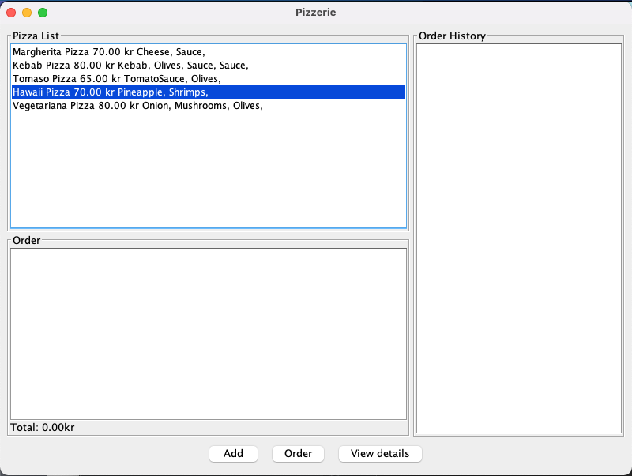
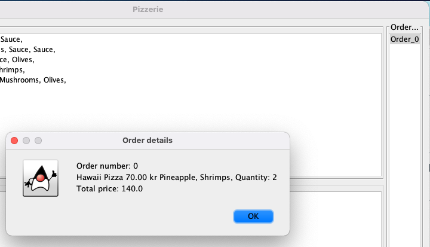

# pizza-order-system
A program that allows you to oder pizza and see your order details. 

## How to order:
Run the program...
1. Select your pizza order
2. Press [Add] 
3. Write the quantity 
4. Place all the types of pizza you want to add to the same order by repeating 1-3  
5. Select [Order] when you are done
6. Add a new order if you prefer to

Here is how the pizzerie main page looks like: 

You can check the details of your order by selecting your order and presseing [View details]:

